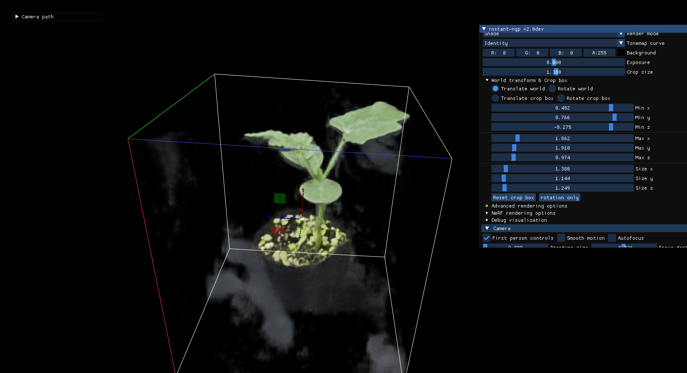
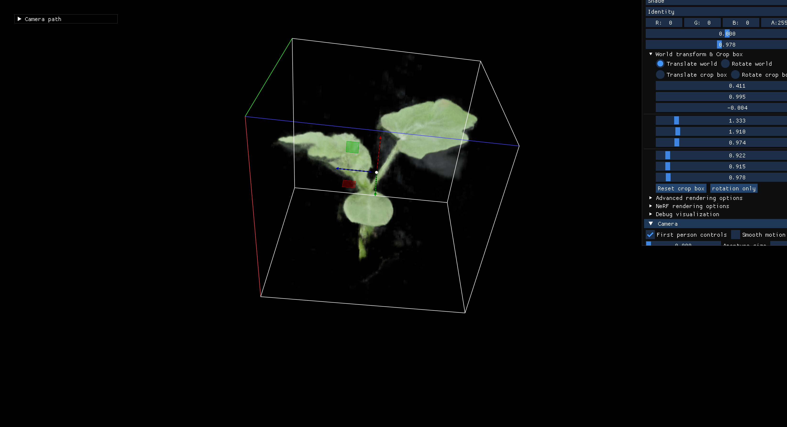

<p align="center">
  
</p>

<p align="center">
  <a href="./README.md"></a>
  <a href="./README.en.md"></a>
</p>

# NeRF 植物三维重建与表型提取

这个仓库包含两部分：
- 论文草稿（`manuscript/`）
- 可运行流水线（`configs/` + `scripts/` + `Makefile`）

目标是把 360 度植株环拍视频，稳定转成：
- NeRF 模型快照
- 网格模型
- 基础表型指标

## 当前状态（2026-03-04）

`maize_plant_01` 已完成多轮重跑，当前流程已稳定到：
- 输入：360 视频自动抽帧（帧数随视频时长与 `fps` 动态变化）
- 产物：`instant-ngp.msgpack` + `mesh.ply` + `traits.csv`
- 命令：支持全流程一键重跑与分阶段续跑

说明：`traits.csv` 目前仍属于重建坐标系下的相对量，后续可接入物理尺度标定。

## 成果展示（更新视频）

| View 1 | View 2 |
| --- | --- |
|  |  |

## 推荐环境（Conda）

建议使用 Python 3.11：

```bash
conda create -n nerf python=3.11 -y
conda activate nerf
pip install -r requirements.txt
make bootstrap
```

系统依赖：
- `COLMAP`
- `ffmpeg`

如果要用 instant-ngp GUI（`--gui`），建议在 `nerf` 环境补齐 OpenGL/X11 包：

```bash
conda install -n nerf -c conda-forge \
  libgl-devel libglu xorg-libx11 xorg-libxext \
  xorg-libxrandr xorg-libxi xorg-libxinerama xorg-libxcursor
```

## 数据目录（视频优先）

初始化数据集：

```bash
make init DATASET=maize_plant_01
```

目录结构：

```text
data/raw/maize_plant_01/
├── video/      # 原始视频
└── images/     # 抽帧结果（可自动生成）
```

默认视频路径：

```text
data/raw/<dataset_id>/video/capture.mp4
```

如果视频文件名不同，修改 `configs/datasets/<dataset_id>.toml` 中 `dataset.video_input`。  
也可以把 `video_input` 设成 `auto`，脚本会在 `video_dir` 下自动识别单个视频。

## 指令集（常用）

全流程（推荐）：

```bash
make check DATASET=maize_plant_01
make run DATASET=maize_plant_01
```

如果终端看不到实时训练进度（常见于 `conda run` 输出缓存），用：

```bash
make run-live DATASET=maize_plant_01
```

只抽帧：

```bash
make frames DATASET=maize_plant_01
```

只看将执行的命令（不实际运行）：

```bash
make dry-run DATASET=maize_plant_01
```

只重做位姿与 transforms（换视频后常用）：

```bash
python scripts/pipeline.py \
  --config configs/pipeline.toml run \
  --dataset maize_plant_01 \
  --stages colmap,colmap_to_text,transforms
```

从训练开始续跑：

```bash
python scripts/pipeline.py \
  --config configs/pipeline.toml run \
  --dataset maize_plant_01 \
  --stages train_instant_ngp,export_geometry,extract_traits
```

说明：`colmap` 阶段现在会自动清理旧的 `colmap/`、`colmap_text/` 与 `transforms.json`，避免重跑时读到过期索引导致 `frame_xxxxxx.jpg` 缺失报错。

## 训练过程可视化

已接入“分段训练 + 自动截图 + 自动合成视频”。

默认输出：
- 逐段截图：`outputs/<dataset_id>/training_vis/frames/frame_0001.png` ...
- 步数映射：`outputs/<dataset_id>/training_vis/progress_steps.csv`
- 进度视频：`outputs/<dataset_id>/training_vis/progress.mp4`

开关在 `configs/datasets/<dataset_id>.toml` 的 `[reconstruction]`：
- `training_vis_enabled = true|false`
- `training_vis_chunk_steps`（每多少步截图一次）
- `training_vis_video_fps`

说明：开启后训练总耗时会略增加（因为每个 chunk 会额外导出一张渲染图）。

## 如何查看成果

1. 看指标表：

```bash
cat outputs/maize_plant_01/traits.csv
```

2. 看 NeRF（GUI）：

```bash
python third_party/instant-ngp/scripts/run.py \
  --scene data/processed/maize_plant_01 \
  --load_snapshot outputs/maize_plant_01/instant-ngp.msgpack \
  --gui
```

3. 看网格（MeshLab/CloudCompare）：

```bash
meshlab outputs/maize_plant_01/mesh.ply
```

或：

```bash
cloudcompare outputs/maize_plant_01/mesh.ply
```

## 常见问题与处理

1. 报错：`ModuleNotFoundError: No module named 'pyngp'`
- 原因：instant-ngp Python 绑定未编译。
- 处理：重新编译 `third_party/instant-ngp/build`，并执行 `make check`。

2. 报错：`No training images were found for NeRF training`
- 原因：`transforms.json` 中 `file_path` 不可解析。
- 处理：已接入自动修复脚本，可手动执行：

```bash
python scripts/fix_transforms_paths.py \
  --transforms data/processed/<dataset_id>/transforms.json \
  --project-root .
```

3. 报错：`NGP was built without GUI support`
- 原因：编译时 `NGP_BUILD_WITH_GUI=OFF` 或缺 OpenGL/X11 依赖。
- 处理：安装 GUI 依赖后重编 instant-ngp。

4. 训练时终端“看起来没输出”
- 原因：`conda run -n ...` 下 `tqdm` 进度条可能不刷新。
- 建议：激活环境后直接运行 `python ...`。

5. COLMAP 中出现 `CHOLMOD warning: Matrix not positive definite`
- 通常是 BA 阶段常见告警，不等于立即失败。
- 重点看流程是否继续推进到 `colmap_to_text` / `transforms` / `train`。

6. 报错：`imread(...frame_xxxxxx.jpg): can't open/read file` + `cvtColor ... !_src.empty()`
- 原因：`colmap_text/images.txt` 里的帧索引与当前 `data/raw/<dataset>/images` 不一致（典型于换视频后沿用旧 COLMAP 工作目录）。
- 处理：直接重跑 `colmap,colmap_to_text,transforms` 或 `make run`（当前流程已在 colmap 前自动清理旧中间产物）。

## 常用参数（数据集配置）

配置文件：`configs/datasets/<dataset_id>.toml`

视频参数（`[video]`）：
- `fps`
- `start_time`
- `end_time`
- `max_frames`
- `resize_width` / `resize_height`
- `overwrite`

COLMAP 参数（`[colmap]`）：
- `data_type`
- `quality`
- `single_camera`
- `use_gpu`
- `gpu_index`
- `num_threads`
- `openblas_num_threads`

重建参数（`[reconstruction]`）：
- `aabb_scale`
- `ngp_steps`
- `marching_cubes_res`
- `keep_colmap_coords`

表型参数（`[traits]`）：
- `vertical_axis`

## 输出位置

- 运行日志：`outputs/runs/<dataset_id>/pipeline.log`
- 快照：`outputs/<dataset_id>/instant-ngp.msgpack`
- 网格：`outputs/<dataset_id>/mesh.ply`
- 指标：`outputs/<dataset_id>/traits.csv`
- 训练可视化：`outputs/<dataset_id>/training_vis/`

## 实验记录

- 总日志：[docs/EXPERIMENT_LOG.md](./docs/EXPERIMENT_LOG.md)
- 单次模板：[docs/EXPERIMENT_RUN_TEMPLATE.md](./docs/EXPERIMENT_RUN_TEMPLATE.md)
- 命令速查：[docs/COMMANDS.md](./docs/COMMANDS.md)

## 项目结构

```text
.
├── assets/
├── configs/
│   ├── pipeline.toml
│   └── datasets/
├── docs/
│   ├── COMMANDS.md
│   ├── EXPERIMENT_LOG.md
│   └── EXPERIMENT_RUN_TEMPLATE.md
├── manuscript/
├── scripts/
│   ├── bootstrap_third_party.sh
│   ├── pipeline.py
│   ├── extract_video_frames.py
│   ├── fix_transforms_paths.py
│   ├── render_mesh_preview.py
│   └── extract_traits.py
├── src/
│   └── nerf_plant_pipeline/
├── Makefile
├── requirements.txt
├── README.md
├── README.en.md
└── manuscript_package.tar.gz
```

## 论文本地编译

```bash
cd manuscript
/Library/TeX/texbin/xelatex -interaction=nonstopmode nerf_plant_reconstruction.tex
/Library/TeX/texbin/xelatex -interaction=nonstopmode nerf_plant_reconstruction.tex
```
